# jobAgent

This directory contains two related modules:

- jobFinderAgent: Flask API service for job chat/search/apply orchestration
- jobApplyAgent: Google Form automation internals used by jobFinderAgent

## Architecture



## Start jobFinderAgent

```bash
cd jobFinderAgent
python3 -m venv venv
source venv/bin/activate
pip install -r requirements.txt
python api.py
```

## Integration

- Frontend page /job-agent calls jobFinderAgent endpoints on port 5001.
- jobFinderAgent imports and uses jobApplyAgent directly.

## References

- jobFinderAgent/README.md
- jobFinderAgent/API_INTEGRATION.md
- jobApplyAgent/README.md
