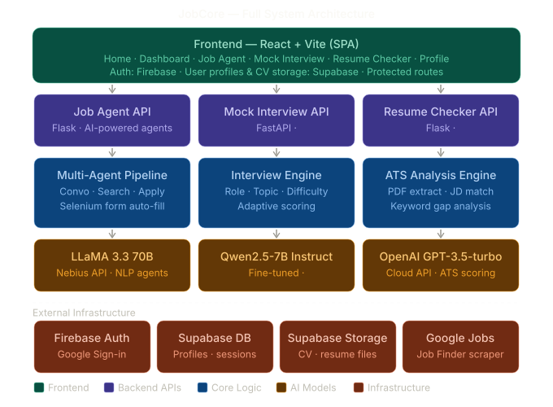

# JobCore

JobCore is an AI-powered career platform that combines:

- AI job discovery and conversational search
- Semi-automated Google Form application flow
- ATS resume analysis
- Mock interview APIs
- User profile and CV management

This repository contains both frontend and backend services used in the CSE499 project.

## Repository Structure

```text
JobCore/
	Project/
		Frontend/                      # React + Vite web app
		Backend/
			jobAgent/
				jobFinderAgent/            # Job search + chat + apply orchestration (Flask)
				jobApplyAgent/             # Google Form automation helpers (Selenium)
			resumeChecker/               # ATS resume checker API (Flask)
			mockInterview/               # Mock interview question/evaluation API (FastAPI)
	Others/                          # Milestone updates, screenshots, reports
```

## Tech Stack

- Frontend: React 19, Vite, Tailwind CSS, React Router, Supabase JS, Firebase SDK
- Backend APIs: Flask, FastAPI, OpenAI SDK, OpenAI Agents SDK, Selenium
- Data and auth: Supabase Auth, Supabase Postgres, Supabase Storage
- AI providers:
	- Nebius (Llama models) for job search/chat routing
	- OpenAI models for resume analysis and mock interview APIs
	- SerpAPI for Google Jobs search results

## System Architecture

```text
Frontend (Vite/React)
	|- /job-agent       -> calls JobFinder API (5001)
	|- /resume-checker  -> calls ResumeChecker API (5004)
	|- /mock-interview  -> text interview selector page
	|- /mock-interview/text -> text interview flow backed by mock interview API (5002)
	|- voice option     -> external Vapi demo link
	|- /profile         -> reads/writes Supabase tables + storage

Backend Services
	|- jobFinderAgent   (Flask, 5001)
	|- resumeChecker    (Flask, 5004)
	|- mockInterview    (FastAPI, 5002)

Data Layer
	|- Supabase Auth
	|- profiles/work_experience/education tables
	|- avatars/cvs storage buckets
```



## Prerequisites

- Node.js 18+
- npm 9+
- Python 3.10+
- Google Chrome (required for Google Form automation)
- Supabase project (for auth/profile/CV storage)
- API keys:
	- NEBIUS_API_KEY
	- SERPAPI_API_KEY
	- OPENAI_API_KEY

## Quick Start

Open separate terminals for each service.

### 1) Frontend

```bash
cd Project/Frontend
npm install
npm run dev
```

Frontend default URL: http://localhost:5173

### 2) Job Agent Backend

```bash
cd Project/Backend/jobAgent/jobFinderAgent
python3 -m venv venv
source venv/bin/activate
pip install -r requirements.txt
python api.py
```

Job Agent API URL: http://localhost:5001

### 3) Resume Checker Backend

```bash
cd Project/Backend/resumeChecker
python3 -m venv .venv
source .venv/bin/activate
pip install -r Requirements.txt
python app.py
```

Resume Checker API URL: http://localhost:5004

### 4) Mock Interview Backend (required for the text interview flow)

```bash
cd Project/Backend/mockInterview
python3 -m venv .venv
source .venv/bin/activate
pip install -r requirements.txt
pip install requests
uvicorn main:app --host 0.0.0.0 --port 5002 --reload
```

Mock Interview API URL: http://localhost:5002
This backend powers the text interview flow in the frontend mock interview page.

## Environment Variables

### Frontend (.env.local)

```env
VITE_SUPABASE_URL=
VITE_SUPABASE_ANON_KEY=

# Optional if Firebase is used
VITE_apiKey=
VITE_authDomain=
VITE_projectId=
VITE_storageBucket=
VITE_messagingSenderId=
VITE_appId=
```

### Job Finder (.env)

```env
NEBIUS_API_KEY=
SERPAPI_API_KEY=

# Optional legacy/extended keys
BRIGHT_DATA_API_KEY=
OPENAI_API_KEY=
```

### Resume Checker (.env.local)

```env
OPENAI_API_KEY=
```

### Mock Interview (.env.local)

```env
OPENAI_API_KEY=
PORT=5002
```

## Core Features

- Job Agent chat flow with intent routing and job recommendations
- External apply link extraction
- Interactive Google Form autofill with follow-up question handling
- ATS resume scoring with missing keyword extraction
- Profile dashboard with:
	- Avatar upload
	- CV upload/download via signed URLs
	- Work and education sections
	- Contact and role preferences

## API Overview

### JobFinder API (5001)

- GET /api/health
- POST /api/chat
- POST /api/search-jobs
- POST /api/extract-apply-url
- POST /api/apply/start
- POST /api/apply/continue
- POST /api/apply/gmail-login
- GET /api/apply/gmail-login/status

### ResumeChecker API (5004)

- GET /
- GET /health
- POST /check_resume

### MockInterview API (5002)

- GET /
- GET /health
- GET /options
- POST /api/interview/start
- POST /api/interview/answer
- GET /api/interview/summary/{session_id}
- POST /api/interview/question
- POST /api/interview/evaluate

## Documentation Map

- Project/Frontend/README.md
- Project/Backend/README.md
- Project/Backend/jobAgent/jobFinderAgent/README.md
- Project/Backend/jobAgent/jobFinderAgent/API_INTEGRATION.md
- Project/Backend/jobAgent/jobApplyAgent/README.md
- Project/Backend/resumeChecker/README.md
- Project/Backend/mockInterview/README.md

## Security Notes

- Never commit real API keys or secrets to version control.
- Rotate any key that was previously exposed in a tracked file.
- Keep .env and .env.local files local-only.

## Weekly Update Link

Google Sheet Weekly Update:
https://docs.google.com/spreadsheets/d/1pvP4X_0nwXPnuPGmRXy4jGbMBZaEPu2DvivW0J3x6LY/edit?usp=sharing
